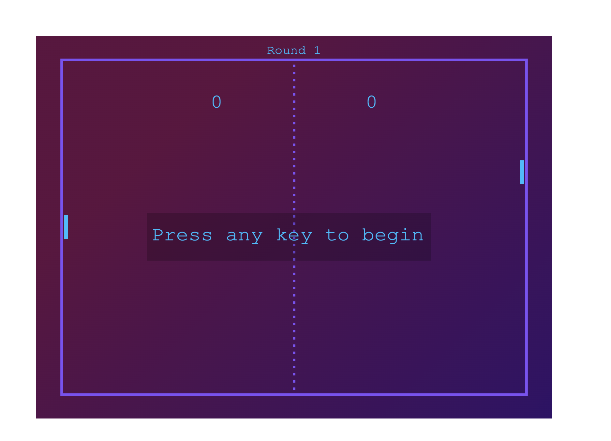
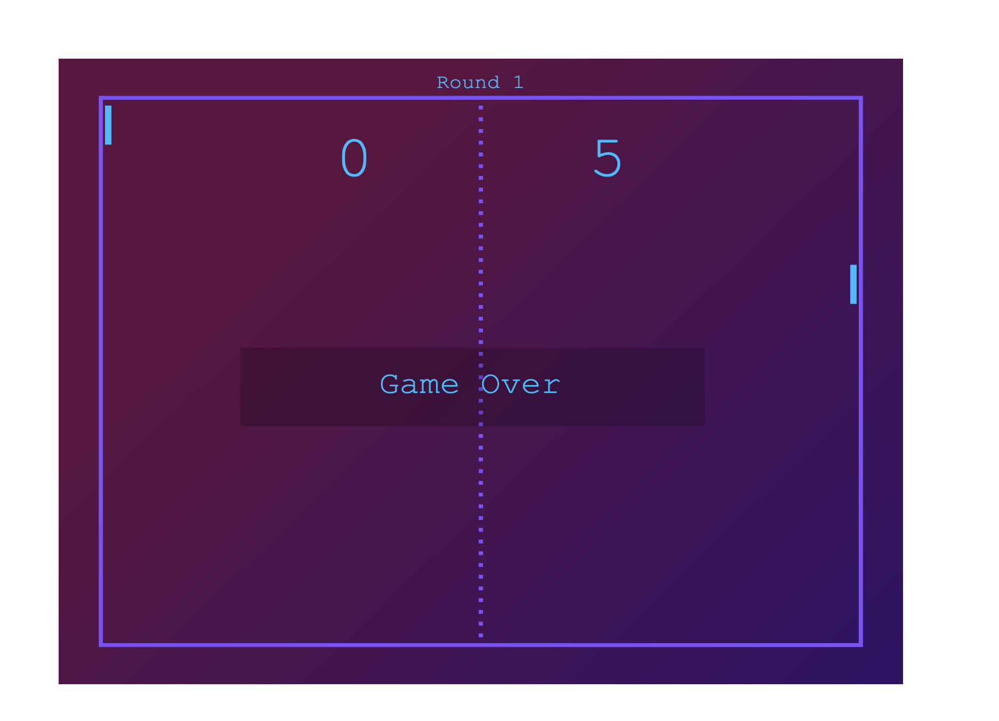

<!-- PROJECT LOGO -->
 

  
  <h3 align="center">Pong Game</h3>
  

     
    <a href="https://andreinadsc.github.io/pong-game/">View Demo</a>
    ·
    <a href="https://github.com/andreinadsc/pong-game/issues">Report Bug</a>
  

  
Table of Contents

  <ol>
    <li>
      <a href="#about-the-project">About The Project</a>
    </li>
    <li>
        <a href="#built-with">Built With</a>
    </li>
    <li>
      <a href="#getting-started">Getting Started</a>
    </li>
    <li><a href="#contact">Contact</a></li>
  </ol>

## About The Project

A simple pong game with javascript using Canvas.

(<a href="#readme-top">back to top</a>)

## Built With

* 
* 
* 

(<a href="#readme-top">back to top</a>)

<!-- GETTING STARTED -->
## Getting Started

The player plays on the left side of the panel and to start the game just press any key. The paddle moves up and down, and to move it you can press the arraowup and arrowdown keys or the w and s keys.

The game consists of 5 rounds, where you must score 5 five points to pass to the next round. Only by winning the fifth round you win the game, but if you lose in any of the rounds you will go back to the first round.

<!-- CONTACT -->

## Contact

María Andreina Da Silva - andreinadsc@gmail.com

(<a href="#readme-top">back to top</a>)
